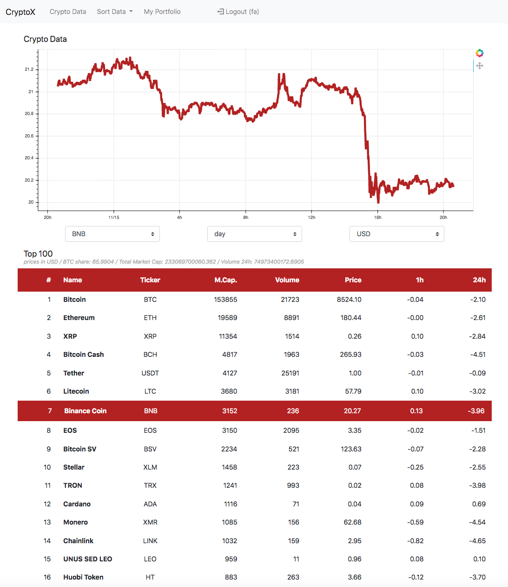

# CryptoWeb

## Description
Website dedicated to the generation and display of data using different free APIs
Mobile responsive website and graphical elements
DB driven user access and storage of user generated data

## Features & Challenges
### Python Django backend
  - User creation and identification
  - Sqlite3 DB for user generated data storage

### Crypto:
- Different APIs
- Data retrieval, date&time manipulation
- Responsive Charts generated with Bokeh
- Responsive data tables (hide columns on small screens)

## TODO:
- User Portfolio: add, remove coins

## TO THINK:
- price notifications system...
